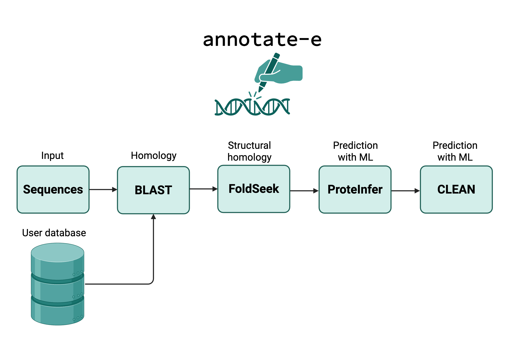

# annotate-e

Annotator for enzymes using an ensemble of tools to annoatte function to genes.




## Install:

```
conda create --name annotatee python=3.11
pip install annotatee
pip install enzymetk
conda install -c bioconda -c conda-forge diamond
conda install -c conda-forge -c bioconda foldseek
```

## Run:

## Setup:
Download sequences for your database (e.g. swissprot as a fasta file)
e.g. the fasta file from UniProt SwissProt with annotations. Format:
```
>someid1
MRWQEMGYIF
>someid2
MRWQEMGYIF
```

## Arguments:
Pass a fasta file as the database and a fasta file that you seek to search against the database. 

The database will first get searched for existing anontations, and otherwise ML methods will be used.

Example command:
```
 annotatee fasta query.fasta ref.fasta --methods blast,foldseek --run-name example_output
```

(see example fasta files in the `example_data` folder, run the above command with them!)

### Example command passing database to foldseek

```
annotatee fasta input_df.csv Uniprot_reviewed_catalytic_activity_06032025.fasta --methods blast,foldseek  --foldseek-db foldseek/structures/pdb/pdb --output-folder output/ --run-name omgprot50

```

### Depending on which/if all tools install each respective tool

Note you may have issues with dependencies e.g. proteiner requires python 3.7 which needs special channels on mac... these ones don't work as easily...
```
git clone git@github.com:ArianeMora/annotate-e.git
source install_scripts/clean.sh
source install_scripts/proteinfer.sh
```

You'll need to pass the directory of the install for CLEAN and proteInfer to `annotatee`. e.g. `--clean-dir ...../CLEAN/app/`

Note! requires enzymetk to also be installed: [enzymetk](https://github.com/ArianeMora/enzyme-tk). 
```
pip install enzymetk
```

For now to run with CLEAN and proteInfer please follow their instructions respectfully (I will make this simpler when I can do a data drop on Zenodo - if you want to use our versions, please email or post an `issue`).

[Install Proteiner](https://github.com/google-research/proteinfer) and [Install CLEAN](https://github.com/tttianhao/CLEAN)


### Help

```
annotattee --help

 Usage: annotatee [OPTIONS] QUERY_FASTA DATABASE                                                                                                                                                       
                                                                                                                                                                                                       
 Find similar proteins based on sequence or structural identity in order to annotate these using  BLAST and FoldSeek. Also annotate with ProteInfer and CLEAN.                                         
                                                                                                                                                                                                       
╭─ Arguments ─────────────────────────────────────────────────────────────────────────────────────────────────────────────────────────────────────────────────────────────────────────────────────────╮
│ *    query_fasta      TEXT  Full path to query fasta or csv (note have simple IDs otherwise we'll remove all funky characters.) [default: None] [required]                                          │
│ *    database         TEXT  Full path to database fasta (for BLAST and FoldSeek) [default: None] [required]                                                                                         │
╰─────────────────────────────────────────────────────────────────────────────────────────────────────────────────────────────────────────────────────────────────────────────────────────────────────╯
╭─ Options ───────────────────────────────────────────────────────────────────────────────────────────────────────────────────────────────────────────────────────────────────────────────────────────╮
│ --output-folder                           TEXT  Where to store results (full path!) [default: Current Directory]                                                                                    │
│ --run-name                                TEXT  Name of the run [default: annotatee]                                                                                                                │
│ --clean-dir                               TEXT  Directory (full path) to CLEAN - if not using the default)                                                                                          │
│ --proteinfer-dir                          TEXT  Directory (full path) to proteiner - if not using the default)                                                                                      │
│ --run-method                              TEXT  Run method (filter or complete) i.e. filter = only annotates with the next tool those that couldn't be found. [default: complete]                   │
│ --keep-dups             --no-keep-dups          Whether or not to keep multiple predicted values if False only the top result is retained. [default: no-keep-dups]                                  │
│ --args-blast                              TEXT  comma separated list (no spaces) of arguments to pass to Diamond BLAST                                                                              │
│ --args-foldseek                           TEXT  comma separated list (no spaces) of arguments to pass to foldseek                                                                                   │
│ --args-proteinfer                         TEXT  comma separated list (no spaces) of arguments to pass to ProteInfer                                                                                 │
│ --args-clean                              TEXT  comma separated list (no spaces) of arguments to pass to CLEAN                                                                                      │
│ --methods                                 TEXT  comma separated list (no spaces) of methods to run (e.g. could just pass ['foldseek', 'proteinfer']) to pass to CLEAN                               │
│ --foldseek-db                             TEXT  Database for foldseek to override fasta before (e.g. path to all pdbs as per foldseek docs.)                                                        │
│ --id-col                                  TEXT  id column in df if df passed (csv) rather than fasta [default: id]                                                                                  │
│ --seq-col                                 TEXT  Database for foldseek to override fasta before (e.g. path to all pdbs as per foldseek docs.) [default: seq]                                         │
│ --install-completion                            Install completion for the current shell.                                                                                                           │
│ --show-completion                               Show completion for the current shell, to copy it or customize the installation.                                                                    │
│ --help                                          Show this message and exit.                                                                                                                         │
╰─────────────────────────────────────────────────────────────────────────────────────────────────────────────────────────────────────────────────────────────────────────────────────────────────────╯

```
